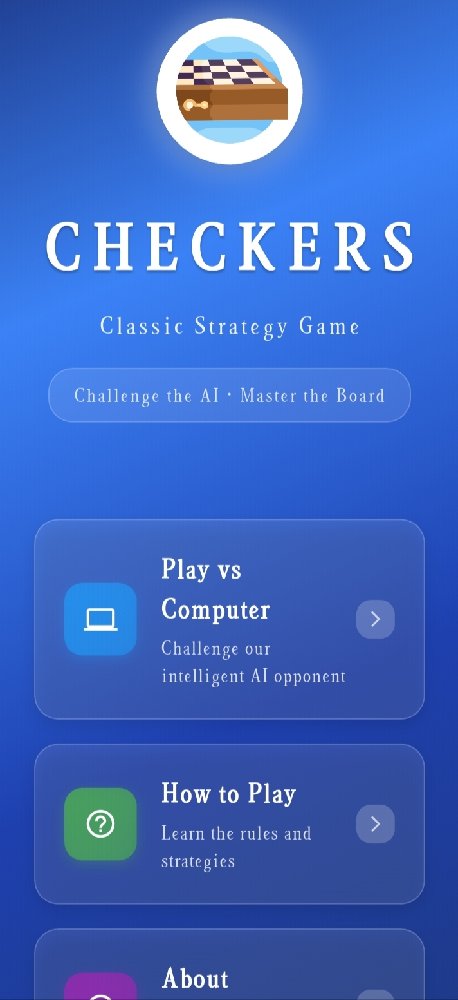
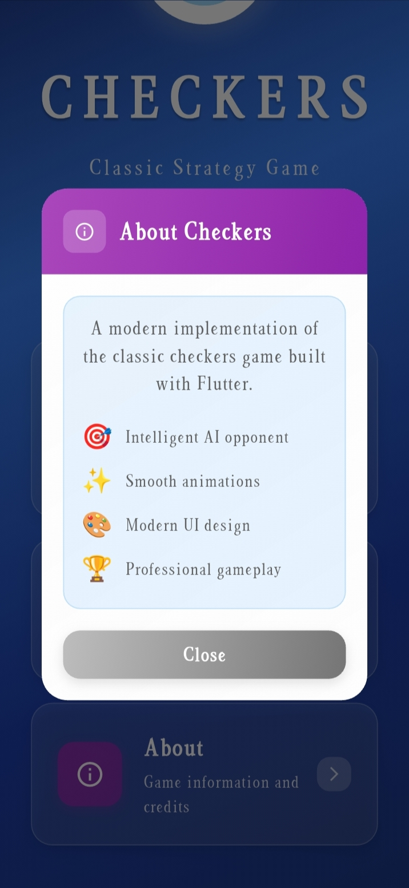
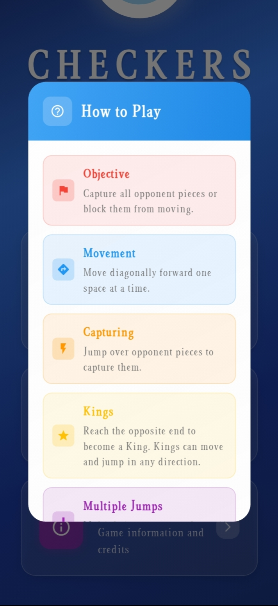
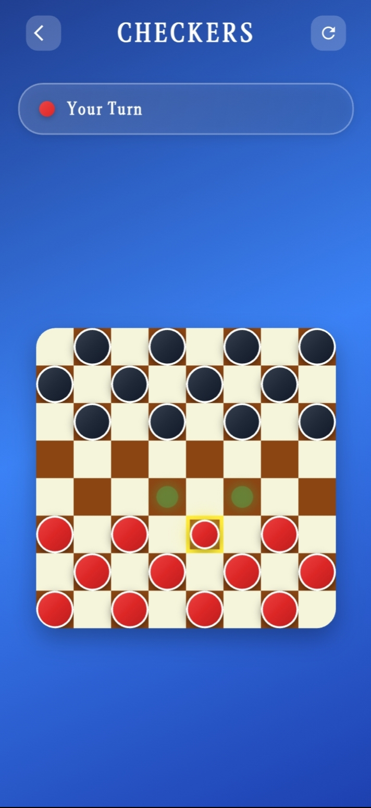
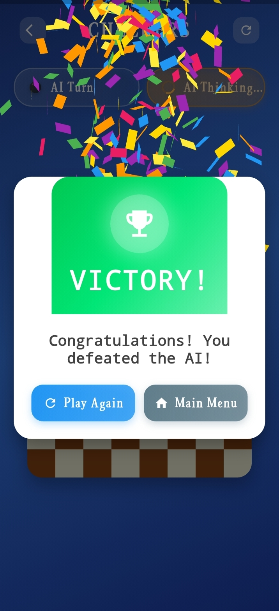

# 🕹️ Checkers Game – Flutter Application

A fully functional, cross-platform checkers game built using **Flutter** and **Dart**, featuring a custom game engine and an intelligent AI opponent powered by the **minimax algorithm with alpha-beta pruning**.

---

## 💡 About the Project

This application was developed as part of an academic assignment, with the goal of creating a complete checkers game from scratch. It includes turn-based logic, move validation, AI decision-making, and a polished, modern user interface.

The project is designed to demonstrate real-world software development skills including architecture design, algorithm implementation, and UI/UX development.

---

## 🧠 AI Engine: Minimax + Alpha-Beta Pruning

The AI logic is implemented using a **depth-limited minimax algorithm**, optimized with **alpha-beta pruning** to skip unnecessary branches in the decision tree. This results in faster move evaluations while maintaining competitive gameplay.

**AI Highlights:**
- Predicts future board states recursively
- Applies an evaluation function based on:
  - Piece count and type (normal or king)
  - Aggressive capture opportunities
  - Positional advantage
- Uses alpha-beta pruning to reduce time complexity
- Prioritizes attacking and king promotion behavior

---

## 🛠️ Technical Features

- ✅ Built with **Flutter 3.8+** and **Dart**
- ✅ Clean **MVC architecture** with separation of logic and UI
- ✅ Full checkers rules:
  - Move validation
  - Mandatory jumps
  - Multi-jumps
  - King promotions
- ✅ AI powered by **minimax + alpha-beta pruning**
- ✅ Responsive UI with **Material Design 3** and **glassmorphism**
- ✅ Smooth transitions, piece animations, and move highlighting
- ✅ Works on **Android** and **Windows**

---

## 📸 Screenshots

<!-- Add your own images or delete this section -->






---

## 🚀 Getting Started

1. **Clone the repository**
   ```bash
   git clone https://github.com/your-username/checker_game.git
   cd checker_game
2. **Install dependencies**
      flutter pub get

3. **Run the application**
      flutter run -d your_device

## 📘 What I Learned

- Designing a rule-based game engine from scratch  
- Implementing AI with **minimax** and **alpha-beta pruning**  
- Structuring code using **clean architecture** principles  
- Building responsive UIs with animations and transitions  
- Handling game state and dynamic user interaction in Flutter  

---

## 📬 Contact

Feel free to connect:

- [LinkedIn](https://www.linkedin.com/in/bershayit)
- [Email](mailto:bershayit@gmail.com)

---

## 🔖 Tags

#Flutter #Dart #AI #GameDevelopment #Minimax #AlphaBetaPruning  
#MobileApp #CrossPlatform #OpenSource #StudentProject #CheckersGame  
#CleanArchitecture #MaterialDesign #Glassmorphism #AndroidApp #WindowsApp  
#TechPortfolio #ProblemSolving #FlutterGame #ModernUI #OpenToWork
